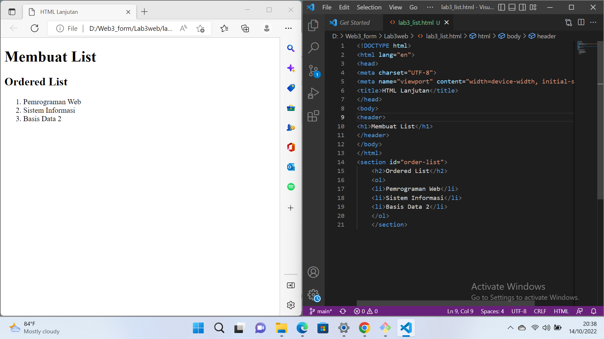
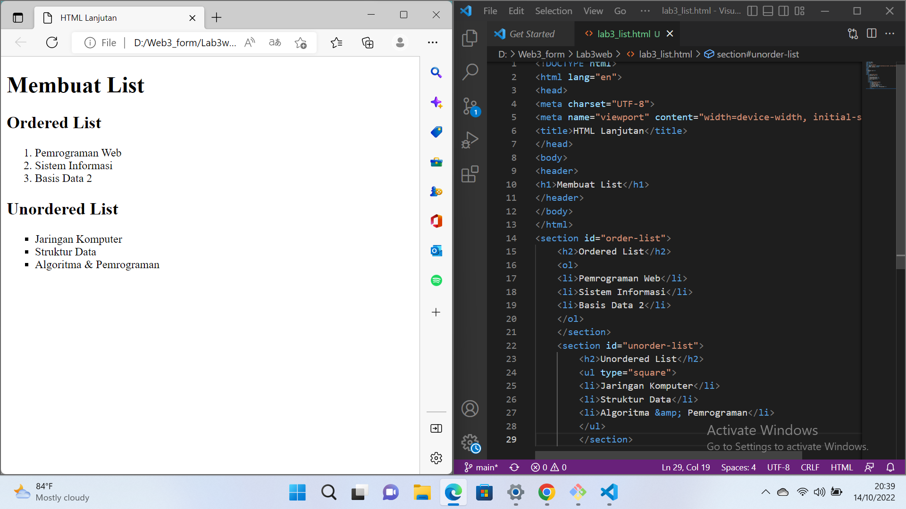
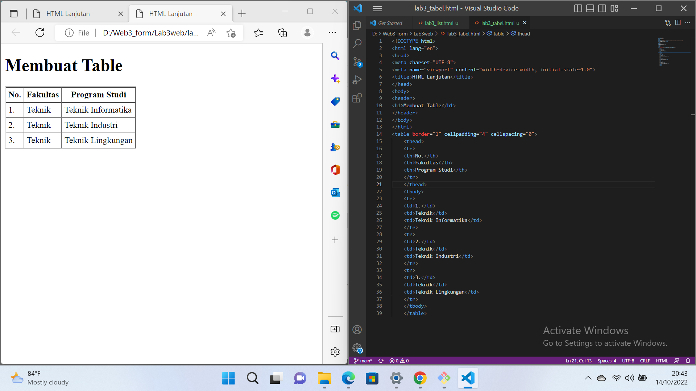
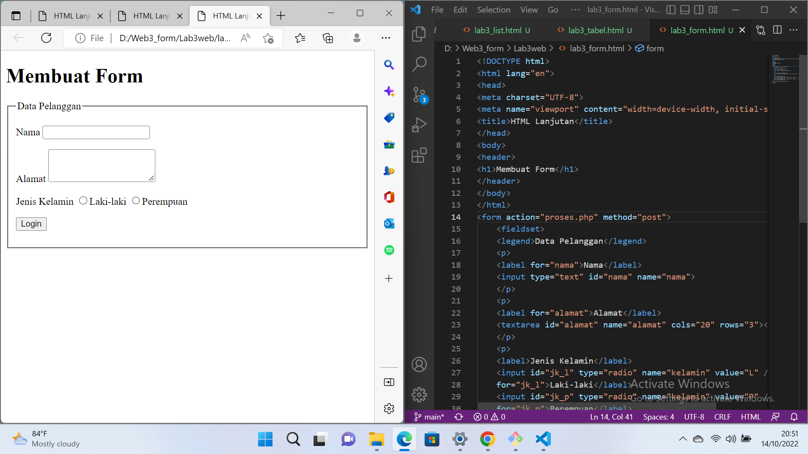
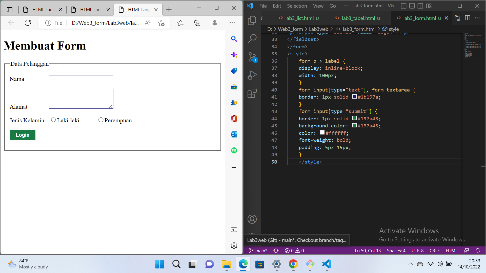
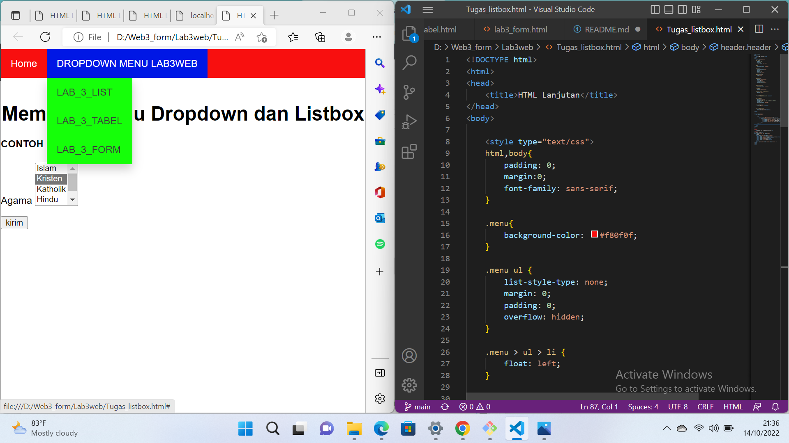
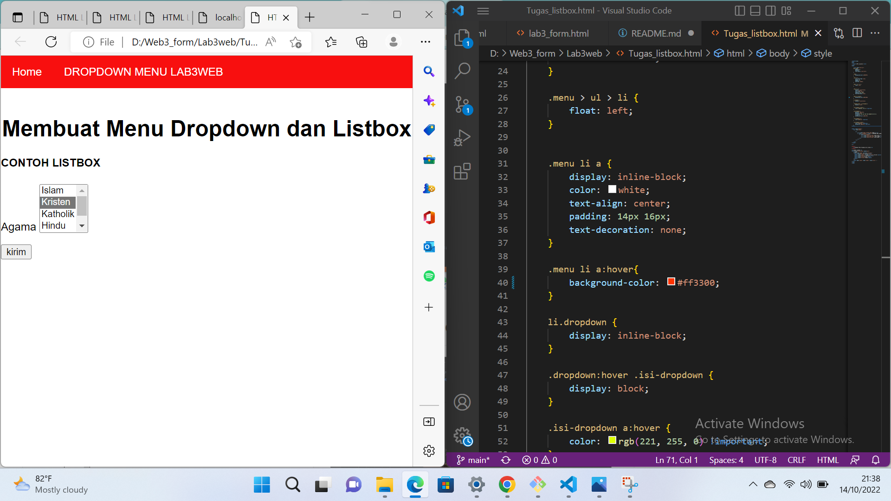

# Lab3web
## andre mahadi
## 312110221
## TI.21.B1
## UNIVERSITAS PELITA BANGSA

1.  Membuat dokumen HTML dengan nama file lab3_list.html dan Membuat Ordered list

2. Membuat Unordered List

3.Membuat file HTML baru dan membuat tabel

4. Menggabungkan sel Data

5. Membuat file HTML baru,Membuat form dan membuat tabel 

6. Menambahkan css agar lebih menarik

PERTANYAAN DAN TUGAS
Membuat form yang menampilkan dropdown menu dan listbox dengan multiple selection.

Membuat Dropdown Menu

Membuat Listbox Dengan Multiple Selection
